# OpenClaw — Technical Architecture

## Overview

OpenClaw is a local-first, event-driven AI agent runtime. It operates as a long-running gateway process that bi-directionally routes messages between chat platforms and LLM providers, while orchestrating tool execution against the local machine. All state (sessions, memory, config) is persisted on-disk. The system is model-agnostic and channel-agnostic — both are pluggable via adapter interfaces.

## High-Level Architecture

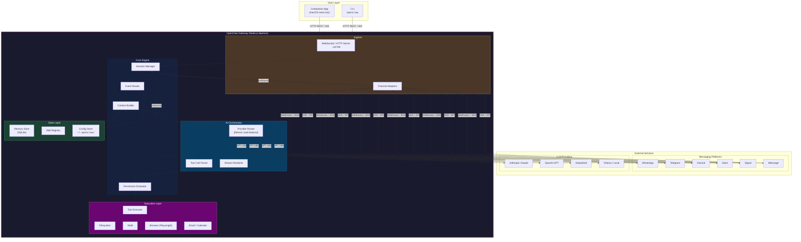

## Components

### 1. Gateway (Ingress)

The gateway exposes a WebSocket/HTTP server (default port `18789`) that accepts connections from the CLI, the companion app, and any custom client. It also hosts the channel webhook endpoints that external platforms push events to.

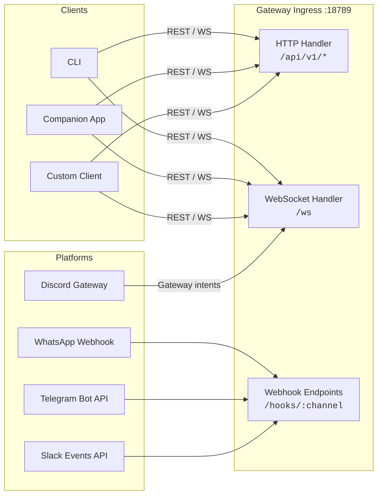

- **HTTP REST** — Used by CLI and companion app for commands (`POST /api/v1/message`, `GET /api/v1/status`).
- **WebSocket** — Persistent bidirectional connection for streaming responses and real-time events.
- **Webhooks** — Platform-specific endpoints that receive push events from messaging services.

### 2. Channel Adapters

Each messaging platform has an adapter implementing a common interface. Adapters handle authentication, message normalization, rate limiting, and platform-specific quirks (e.g., Discord embeds, Telegram inline keyboards).

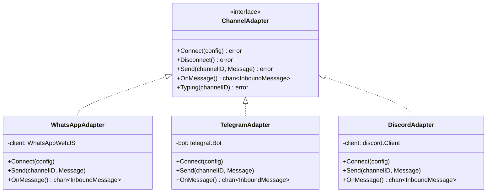

**Message normalization pipeline:**

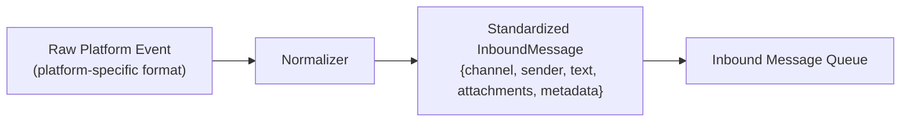

All inbound messages are normalized into a unified `InboundMessage` struct before entering the core engine, regardless of source platform.

### 3. Session Manager

Tracks conversation state per user/channel pair. Each session maintains its own message history and is the unit of isolation between concurrent conversations.

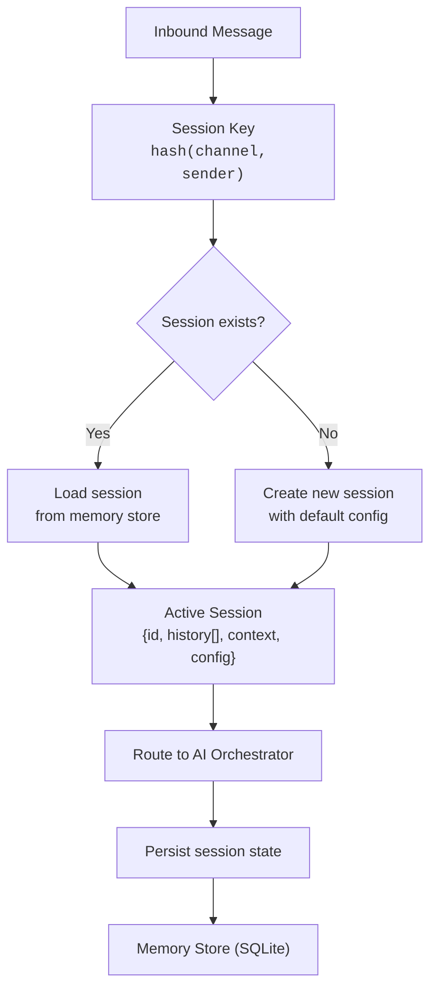

Sessions are keyed by `(channel_type, channel_id, sender_id)` to maintain independent conversations across platforms.

### 4. AI Orchestrator

Manages the interaction loop with LLM providers. Handles provider selection, failover, prompt construction, tool call parsing, and streaming response rendering.

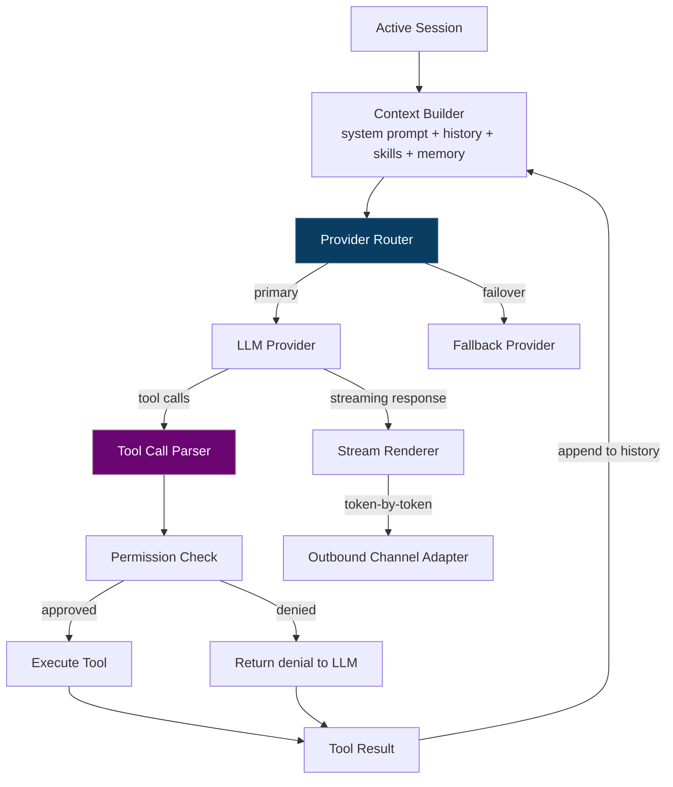

**Provider Router** — Selects which LLM to use based on config, availability, and cost. Supports model failover: if the primary provider returns an error or rate-limits, it automatically falls back to a configured secondary.

**Tool Call Loop** — The LLM may request tool execution mid-response. The orchestrator parses these tool calls, checks permissions, executes them, and feeds results back to the LLM in a loop until the LLM produces a final text response.

**Streaming** — Responses are streamed token-by-token back to the channel adapter, which renders them incrementally (e.g., editing a Discord message as tokens arrive).

### 5. AI Provider Interface

Each provider implements a common interface that abstracts API differences.

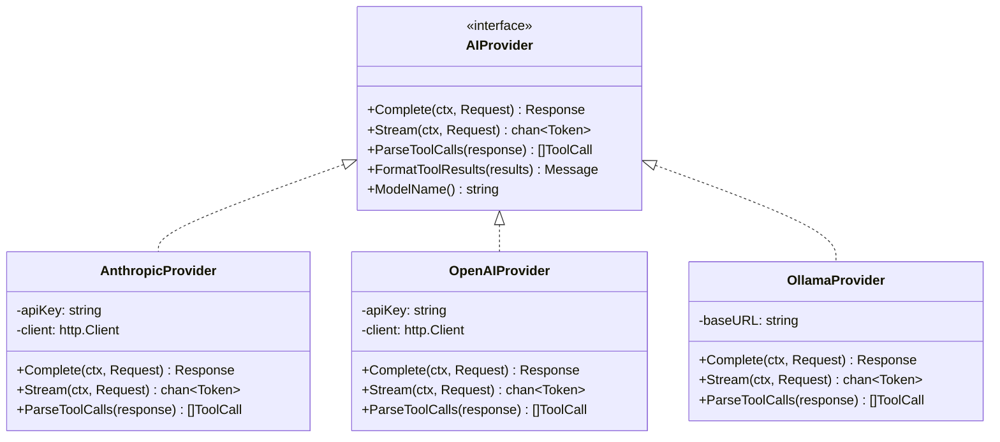

Key differences handled by each provider:
- **Message format** — Anthropic uses `content` blocks, OpenAI uses `messages` array, Ollama uses a different schema
- **Tool call format** — Each provider encodes tool calls differently in the response
- **Streaming protocol** — SSE vs WebSocket vs newline-delimited JSON

### 6. Tool Execution Layer

Sandboxed execution environment for AI-requested actions. Every tool call goes through the permission evaluator before execution.

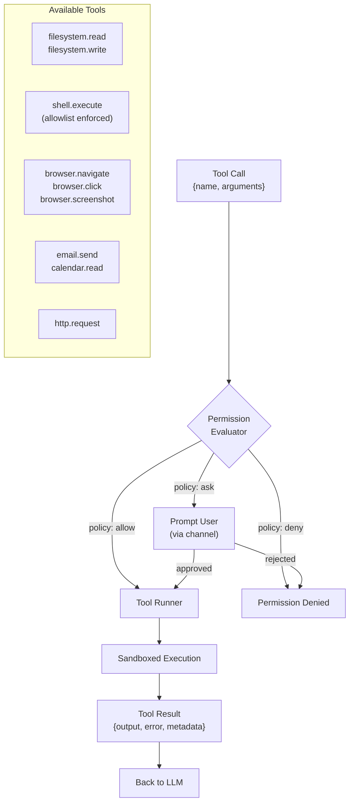

**Permission policies** are defined in `~/.openclaw/permissions.json`:

```json
{
  "filesystem": {
    "allow_paths": ["/home/user/documents"],
    "deny_paths": ["/home/user/.ssh"]
  },
  "shell": {
    "allow_commands": ["git", "npm", "python"],
    "require_approval": ["rm", "sudo"]
  },
  "browser": {
    "allowed_domains": ["*"]
  }
}
```

### 7. Memory Store

SQLite-backed persistent store for conversation history, user preferences, and learned context. The context builder queries this store to inject relevant memory into every LLM request.

```mermaid
flowchart TB
    subgraph Memory Store (SQLite)
        T1["sessions<br/>{id, channel, sender, created_at}"]
        T2["messages<br/>{session_id, role, content, timestamp}"]
        T3["preferences<br/>{key, value, scope}"]
        T4["learned_facts<br/>{fact, source, confidence, last_used}"]
    end

    CTX["Context Builder"] -->|"query"| T1 & T2 & T3 & T4
    T1 & T2 & T3 & T4 -->|"results"| CTX
    CTX -->|"inject into prompt"| LLM["LLM Request"]

    subgraph Context Assembly
        SYS["System Prompt<br/>(identity + skills)"]
        HIST["Recent History<br/>(last N messages)"]
        FACT["Relevant Facts<br/>(semantic search)"]
        PREF["User Preferences"]
    end

    SYS & HIST & FACT & PREF --> PROMPT["Assembled Prompt"]
```

**Context window management:**
- Recent messages are included verbatim (sliding window of last N messages)
- Older history is summarized into compact facts
- Learned facts are retrieved via keyword/semantic matching against the current query
- Total context is kept within the model's token limit

### 8. Skill Registry

Skills are loaded from `~/.openclaw/skills/` directories. Each skill is a directory containing a `SKILL.md` manifest that defines the skill's capabilities, prompts, and tool requirements.

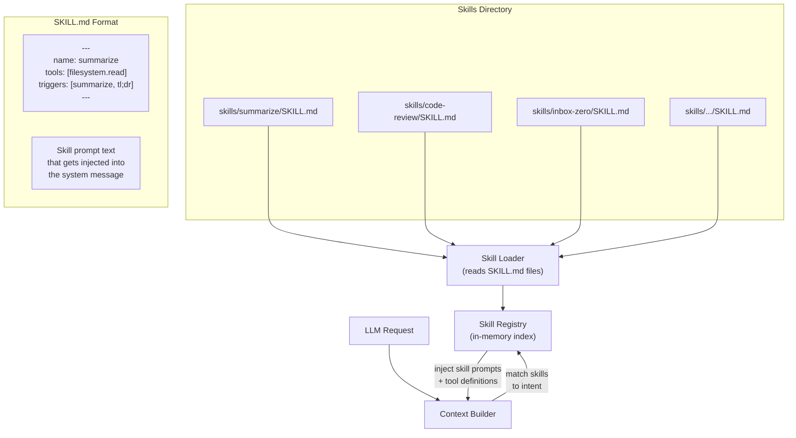

Skills are matched to user intent via trigger keywords. When matched, the skill's prompt and tool definitions are injected into the LLM request context.

### 9. CLI

The CLI (`openclaw`) is a thin client that communicates with the gateway daemon over HTTP/WebSocket.

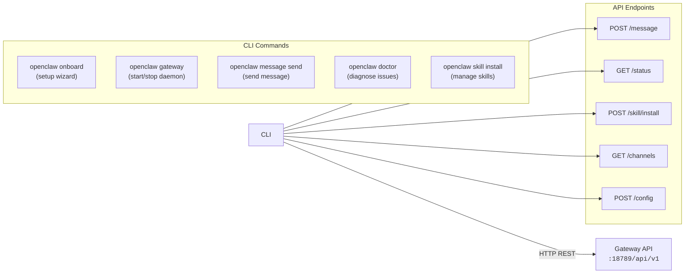

`openclaw onboard` is the exception — it runs before the gateway exists and handles first-time setup (installing Node.js, creating config, generating API keys, installing the daemon service via launchd/systemd).

### 10. Config Store

All configuration is stored in `~/.openclaw/`:

```
~/.openclaw/
├── openclaw.json          # Main config (model, defaults)
├── permissions.json       # Tool permission policies
├── channels/
│   ├── whatsapp.json      # Per-channel credentials
│   ├── telegram.json
│   └── discord.json
├── skills/                # Installed skills
│   └── summarize/
│       └── SKILL.md
├── memory/
│   └── openclaw.db        # SQLite memory store
└── daemon/                # Service config
    ├── launchd.plist      # macOS
    └── openclaw.service   # Linux (systemd)
```

## End-to-End Message Flow

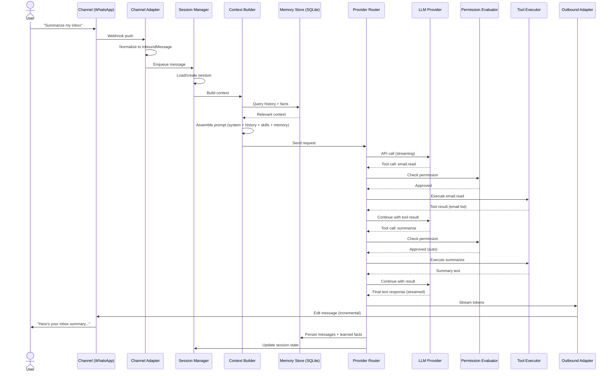

## Concurrency Model

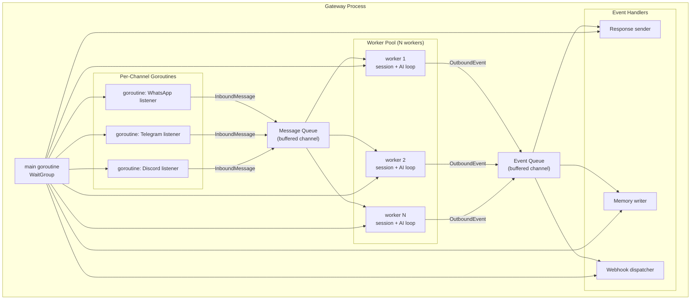

Each channel runs its own listener goroutine. Inbound messages are pushed to a buffered channel (message queue). A worker pool processes messages concurrently — each worker handles the full session/AI/tool loop for one message. Outbound events (responses, memory writes) are pushed to an event queue handled by dedicated goroutines.

Workers are keyed to sessions — messages from the same session are always processed by the same worker to maintain ordering guarantees.

## Startup Sequence

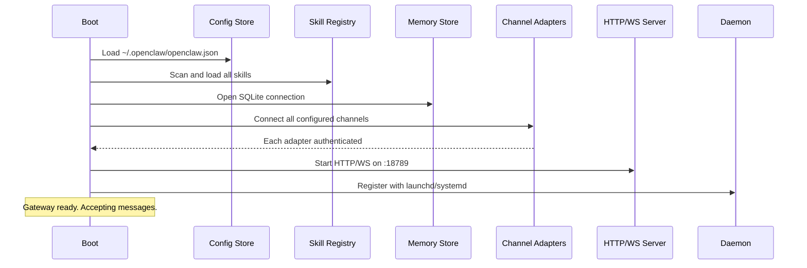

## Data Flow Summary

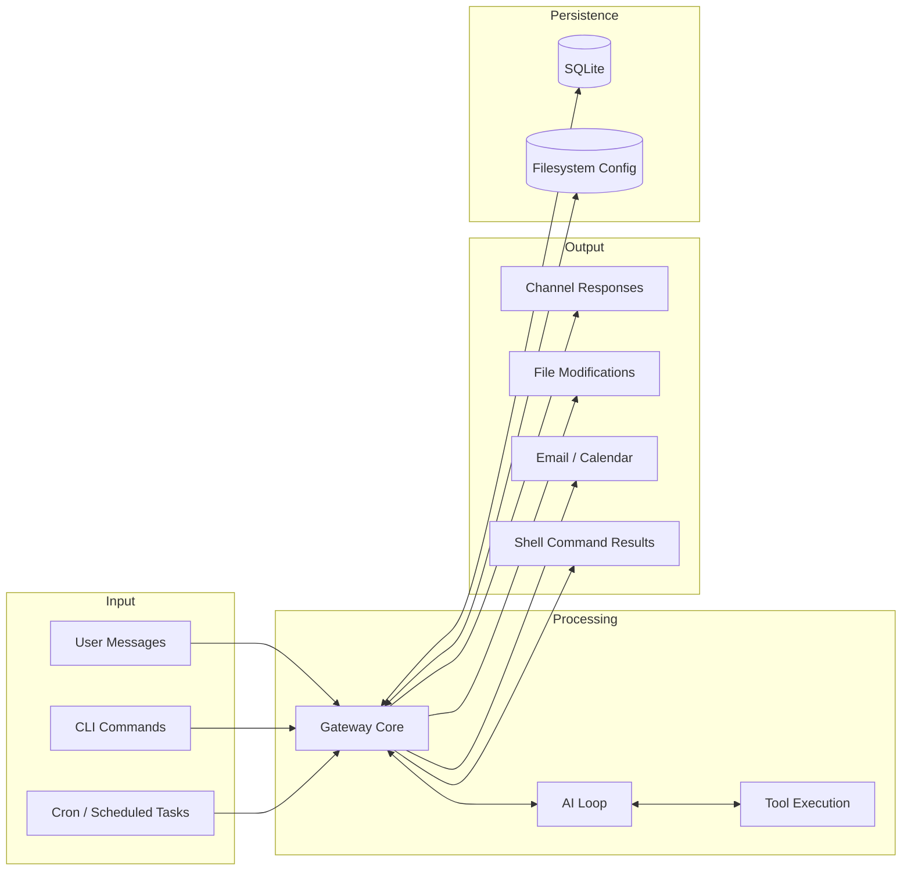
